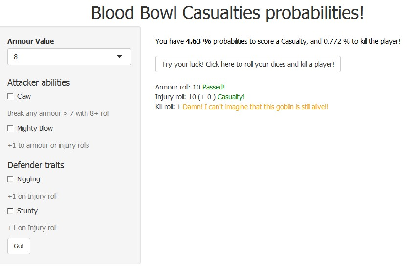

Blood Bowl Casualties probabilities!
========================================================
author: Moreno Riccardi
date: 21/09/2015

Background
========================================================

I'm a big fan of Blood Bowl, a fantasy football tablegame made by Games Workshop, so I'd like to point out some probabilities on one of the main action of the game, Blocks.

As in a normal American football matches, defender can stop the attacker blocking it, and in Bloodbowl it is resolved with some dice roll, and here we focus only on the probabilities to injury (and kill) the enemy.

Assuming that the defender is Knocked down, the  coach rolls two D6 and adds their scores together in an attempt to try to beat the Knocked Down player's Armour value. 
If the roll succeeds, then the coach is allowed to roll on the Injury table:

* 2-7, Stunned
* 8-9, KO 
* 10-12, Casualty

Next, you can kill the player rolling a 6 on a single D6 dice, if you have previously scored a casualty!
 
Click [here](https://morenz.shinyapps.io/BBCas) to try the app.

Interface
========================================================



***
 
Here you have to select Armour and modifier, and then Click Go! button to views probabilities to score a Casualty.

Modifiers:

* Claw: you can break armour > 7 with 8+,
* Mighty Blow: add 1 to armour \*or\* injury roll,
* Niggling and Stunty: add 1 to injury roll.

Moreover you can try your luck, clicking on the other button that simulate some dice rolls!

Some Examples:

* Armour 8 and no modifiers, you have to roll 9+ on Armour roll and a 10+ on Injury roll to score a casualty
* Armour 10 and Claw, Niggling and Stunty, you have to roll 8+ on Armour roll and a 8+ on Injury roll to score a casualty
* Armour 10 and Claw and Mighty Blow, you have to roll 7+ on Armour roll and a 10+ (or 9+ if Armour roll was 8+)  on Injury roll to score a casualty

Probabilities
========================================================

*Without Mighty Blow*

Here you have two independent event, so probabilities to score a casualty are:

$$Pr(Break Armour)*Pr(Score Casualty)$$

and to kill the player are

$$Pr(Break Armour)*Pr(Score Casualty)*(1/6)$$

*With Mighty Blow* 

Here you have two dependent event (only one can happen) of two independent event, so probabilities to score a casualty are:

$$Pr(Break Armour w/MB)*Pr(Score Casualty) + Pr(Break Armour)*Pr(Score Casualty w/MB)$$

and to kill the player are

$$(Pr(Break Armour w/MB)*Pr(Score Casualty) + Pr(Break Armour)*Pr(Score Casualty w/MB))*(1/6)$$

Here's the code use to calculate probabilities after gbarbbing the input:


```r
claw <<-0
mb <<- 0
niggling <<-0
stunty <<- 0
armour <<- 7
input$rolldice==0
armour <<- as.integer(input$armour)
if (input$claw==1 & armour > 7) {armour <<- 7}
if (input$niggling==1) niggling <<- 1
if (input$stunty==1) stunty <<- 1

if (input$mb==1) {
    mb <<- 1
    prob <- (sum(dice>(armour - 1))/36)*(sum(dice>(9-niggling-stunty))/36) 
        + (sum(dice>armour)/36)*(sum(dice>(9-niggling-stunty-1))/36)
} else {
    prob <- (sum(dice>armour)/36)*(sum(dice>(9-niggling-stunty))/36)
}
HTML(paste("<span style=\"font-weight: string; color: #000000;\">
           You have <b>",formatC(prob*100, digits=3), "%</b> probabilities to score a Casualty, 
           and ", formatC(prob*(1/6)*100, digits=3), "% to kill the player!</span><br><br>"))
```

Code Examples
========================================================

To run simulations, I roll Armour Dice, and in case of success Injury Roll and Kill rolls (only if casualty is scored on injury roll)


Here is the code (I've sampled all data, except armour just to be clear) because I haven't any inputs from interface)


```r
claw <-sample(0:1, 1)
mb <- sample(0:1, 1)
niggling <-sample(0:1, 1)
stunty <- sample(0:1, 1)
armour <- 8
armourRoll <- sum(sample(6, 2, replace = TRUE))
tmpMb <- mb
strMbArmour <- ""
strMbInjury <- ""
verifyArmourRoll <- checkArmourRoll(armourRoll)
if (verifyArmourRoll > 0) {
    injuryRoll <- sum(sample(6, 2, replace = TRUE))
    if (verifyArmourRoll == 2) {
        tmpMb <- 0
        strMbArmour <- " (w/MB) "
    }
    verifyInjuryRoll <- checkInjuryRoll(injuryRoll+stunty+niggling, tmpMb)
    if (verifyInjuryRoll == 2) {
        strMbInjury <- " w/MB "
    }
    if (verifyInjuryRoll == 0) {
        paste("<br>Armour roll: ", armourRoll, strMbArmour, " <span style=\"color: green\">Passed!</span><br>
                   Injury roll: ", injuryRoll ,"<span style=\"color: #ff0000\">No casualty!</span>")
    } else {
        
        killRoll <- sample(6, 1)
 
        if (killRoll == 6) { 
            strKill <- paste("<br>Kill roll: ", killRoll, "<span style=\"color: green\">Yeah! You did it!!!</span>")
        } else {
            strKill <- paste("<br>Kill roll: ", killRoll, "<span style=\"color: orange\">Damn! I can't imagine that this goblin is still alive!!</span>")
        }
        
        paste("<br>Armour roll: ", armourRoll, strMbArmour, " <span style=\"color: green\">Passed!</span><br>
                   Injury roll: ", injuryRoll ,"(+",niggling+stunty, strMbInjury,") <span style=\"color: green\">Casualty!</span>",
                   strKill)
    }
} else {
    paste("<br>Armour roll", armourRoll, " <span style=\"color: #ff0000\">Failed to break armour!</span>")
}
```

```
[1] "<br>Armour roll:  11   <span style=\"color: green\">Passed!</span><br>\n                   Injury roll:  7 <span style=\"color: #ff0000\">No casualty!</span>"
```


